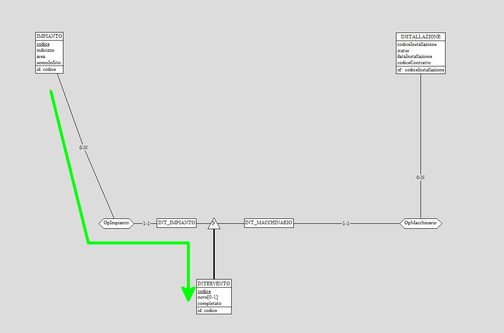
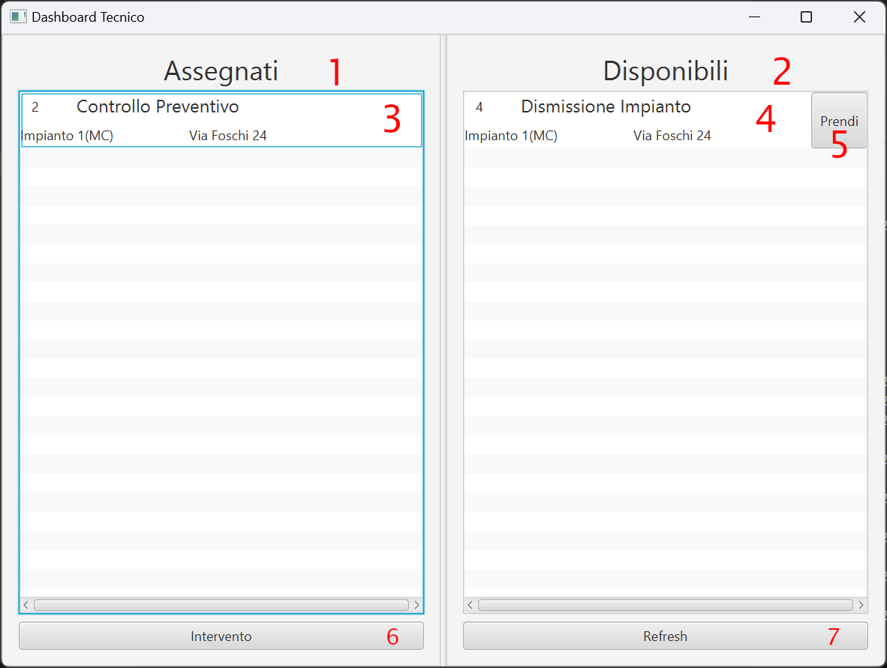
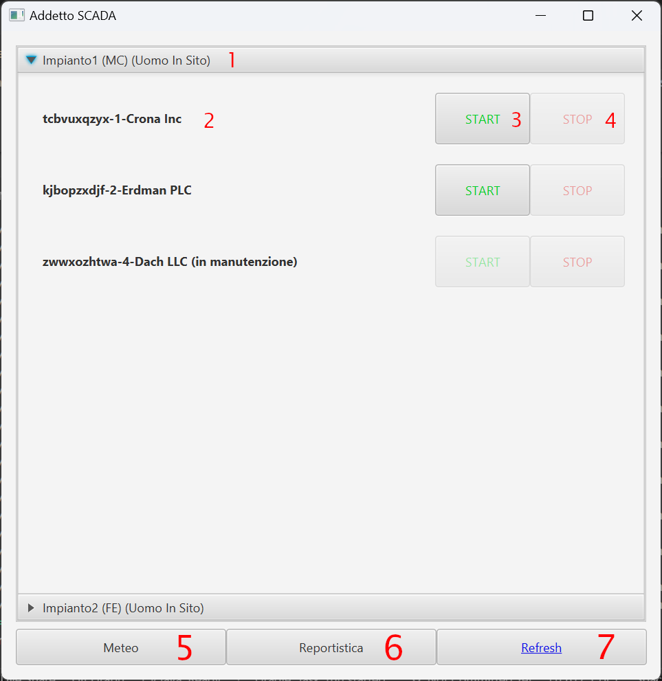

<p style="font-size:10em;">SCADA</p>

Carletti Lorenzo (matr. 0001069213)

Catena Matteo (matr. 0001070908)

Dall'Ara Lorenzo (matr. 0001068964)

# Introduzione
Questo progetto consiste nella realizzazione di un sistema informatico che sia alla base della gestione di impianti energetici da fonti rinnovabili.
Questo sistema informatico si suddivide in quattro sotto-sistemi:
- Un sistema dedicato per organizzare, creare e completare interventi richiesti all'interno degli impianti
- un sistema SCADA (Supervisory Control And Data Acquisition), per la gestione da remoto degli impianti e dell'acquisizione dati.
- Un sistema gestionale utilizzato dai responsabili generali.
- Un database, utilizzato per la memorizzazione e la condivisione dei dati tra i vari sotto-sistemi.

# Analisi dei requisiti
## Intervista
Abbiamo intervistato il responsabile generale della GreenRock S.p.A. per ottere più informazioni su come il sistema informatico deve essere strutturato:
> Abbiamo bisogno di un sistema gestionale che sia in grado di gestire impianti rinnovabili in tutta Italia. Attualmente abbiamo tre tipologie di impianto: Fotovoltaico, Eolico e Biogas.
> I nostri dipendenti si dividono in tre grandi categorie: responsabili, addetti SCADA e tecnici. Per ognuno memorizziamo nome, cognome e area di competenza. Per responsabili e addetti SCADA, loro operano su tutta una regione d'italia, mentre i tecnici possono lavorare soltanto all'interno di una provincia.
> I tecnici si occupano di effettuare vari interventi negli impianti, come per esempio dei controlli preventivi ai macchinari, la riparazione di un macchinario oppure la dismissione completa di un impianto.
> Gli interventi vengono creati dai responsabili, facendo richiesta di operare in un impianto o macchinario specifico, senza assegnarlo direttamente ad un tecnico. In un secondo momento i tecnici all'interno della provincia potranno prendersene carico. Soltanto un tecnico può essere incaricato per ogni intervento.
> Al termine di un intervento, il tecnico incaricato può scrivere delle note aggiuntive che devono essere inviate al responsabile che ha creato l'intervento. Per questo motivo i responsabili devono poter vedere tutti gli interventi, sia quelli completati che quelli in attesa.
> Gli impianti possono essere di un solo tipo e ogni impianto può contenere al suo interno soltanto macchinari di tipologia coerente.
> Nel caso in cui l'impianto sia fotovoltaico oppure eolico, vicino all'impianto vengono installate delle stazioni meteo che registrano i nodi di vento e la percentuale di raggi UV.
> Per gli impianti bisogna memorizzare il codice impianto, la provincia in cui si trova, l'indirizzo dell'impianto, l'area in metri quadri e se sono presenti tecnici al loro interno, in modo da segnalarlo agli addetti SCADA.
> Il codice impianto è valido soltanto all'interno della provincia di appartenenza dell'impianto.
> Noi compriamo i macchinari che vengono prodotti da aziende di terze parti, per cui dobbiamo tener traccia dell'azienda, del modello e della garanzia acquistata tra quelle disponibili per quel preciso modello. Sarebbe utile anche memorizzare le dimensioni del macchinario in termini di area piana e l'elenco delle componenti che possono essere sostituiti nei macchinari, con il loro prezzo.
> Questo elenco ci viene dato direttamente dall'OEM e i nostri tecnici sono certificati, per cui fare la sostituzione delle componenti elencate non annulla la garanzia.
> Quando un macchinario viene installato all'interno di un impianto, gli viene assegnato un codice interno che permette di distinguere due macchinari all'interno dello stesso impianto. Inoltre si deve tener traccia della data d'installazione, dato che questa viene usata per determinare l'inizio del periodo di garanzia.
> Nel caso l'installazione sia fotovoltaica, bisogna memorizzare anche il numero di celle, l'angolo con cui vengono montate le celle e la potenza massima complessiva che può essere generata.
> Nel caso l'installazione sia eolica, per ognuno di essi dobbiamo salvare  uno o più stime energetiche, basate sulla velocità del vento in nodi.
> Infatti lo stesso modello di macchinario, in base a come viene installato, potrebbe avere valori energetici diversi.
> Infine per le installazioni biogas dobbiamo tener traccia del rendimento energetico ottimale, la quantità di batteri presenti e il peso dei rifiuti organici necessari per mantenere il rendimento ottimo, queste ultime due misurate in kilogrammi.
> Gli addetti SCADA si occupano del controllo remoto di più impianti, potendo avviare e fermare i macchinari che sono contenuti al loro interno.
> Se un macchinario è attualmente in manutenzione, perchè un tecnico deve fare un intervento, per motivi di sicurezza gli addetti non possono controllare da remoto il macchinario. Soltanto quando il tecnico ha terminato il suo intervento, allora viene ripristinato il controllo agli addetti.
> Gli impianti che sono sotto la gestione di un determinato addetto SCADA vengono stabili da un responsabile della stessa regione. In generale lo stesso impianto può essere assegnato a più addetti.
> I responsabili possono chiedere agli addetti SCADA di generare dei report, utilizzati per analizzare le prestazioni energetiche di un impianto.
> Nel caso in cui un impianto è disposto di una stazione meteo, l'addetto SCADA che lo controlla può visualizzare la situazione metereologica attorno all'impianto scelto
> Quando viene installato un nuovo impianto in una regione, un responsabile di quella regione ha l'obbligo di inserire nel database tutti i dati rilevanti sull'impianto, compresi i macchinari al suo interno.

## Rilevamento delle ambiguità
L'intervista ad una prima lettura presenta delle ridondanze, ma queste non sono grandi abbastanza da impedire la comprensione del sistema informatico.
Le riportiamo comunque di seguito per avere maggior chiarezza:
- "Addetto SCADA" e "addetto" fanno riferimento alla stessa tipologia di dipendente
- "Installazione Fotovoltaica/Eolica/Biogas" è un sinonimo abbreviato di "Macchinario Fotovoltaico/Eolico/Biogas installato all'interno di un impianto"

## Correzione delle ambiguità ed estrazione dei concetti principali
Di seguito viene riportata l'intervista, corretta sostituendo le ambiguità e riportando i concetti principali.
Con il **grassetto** verranno indicate le entità principali,
con il *corsivo* verranno indicate informazioni importanti

> Abbiamo bisogno di un sistema gestionale che sia in grado di gestire impianti rinnovabili in tutta Italia. Attualmente abbiamo tre tipologie di impianto: *Fotovoltaico, Eolico e Biogas.*
> I nostri dipendenti si dividono in tre grandi categorie: **responsabili**, **addetti SCADA** e **tecnici**. Per ognuno memorizziamo *nome, cognome e area di competenza*. Per responsabili e addetti SCADA, loro operano su tutta una regione d'italia, mentre i tecnici possono lavorare soltanto all'interno di una provincia.
> I tecnici si occupano di effettuare vari **interventi** negli impianti, come per esempio dei *controlli preventivi* ai macchinari, la *riparazione di un macchinario* oppure la *dismissione completa di un impianto*.
> Gli interventi vengono creati dai responsabili, facendo richiesta di operare in un impianto o macchinario specifico, senza assegnarlo direttamente ad un tecnico. *In un secondo momento i tecnici* all'interno della provincia *potranno prendersene carico*. Soltanto un tecnico può essere incaricato per ogni intervento.
> Al termine di un intervento, il tecnico incaricato può scrivere delle note aggiuntive che devono essere inviate al responsabile che ha creato l'intervento. Per questo motivo i responsabili devono poter vedere tutti gli interventi, sia quelli completati che quelli in attesa.
> *Gli **impianti** possono essere di un solo tipo e ogni impianto può contenere al suo interno soltanto macchinari di tipologia coerente*.
> Nel caso in cui l'impianto sia fotovoltaico oppure eolico, vicino all'impianto vengono installate delle **stazioni meteo** che registrano i nodi di vento e la percentuale di raggi UV.
> Per gli impianti bisogna memorizzare il *codice impianto, la provincia in cui si trova, l'indirizzo dell'impianto, l'area in metri quadri e se sono presenti tecnici al loro interno*, in modo da segnalarlo agli addetti SCADA.
> Il codice impianto è valido soltanto all'interno della regione di appartenenza dell'impianto.
> Noi compriamo i **macchinari** che vengono prodotti da aziende di terze parti, per cui dobbiamo tener traccia *dell'azienda, del **modello** e della **garanzia** acquistata* tra quelle disponibili per quel preciso modello. Sarebbe utile anche memorizzare le dimensioni del macchinario in termini di area piana e l'elenco delle componenti che possono essere sostituiti nei macchinari, con il loro prezzo.
> Questo elenco ci viene dato direttamente dall'OEM e i nostri tecnici sono certificati, per cui fare la sostituzione delle componenti elencate non annulla la garanzia.
> *Quando un macchinario viene installato* all'interno di un impianto, *gli viene assegnato un codice interno* che permette di distinguere due macchinari all'interno dello stesso impianto. Inoltre si deve tener traccia della *data d'installazione*, dato che questa viene usata per determinare l'inizio del periodo di garanzia.
> Nel caso in cui venga installato un macchinario fotovoltaico, bisogna memorizzare anche il *numero di celle, l'angolo con cui vengono montate le celle e la potenza massima complessiva che può essere generata*.
> Nel caso in cui venga installato un macchinario eolico, per ognuno di essi dobbiamo salvare *uno o più stime energetiche, basate sulla velocità del vento in nodi*. Infatti lo stesso modello di macchinario, in base a come viene installato, potrebbe avere valori energetici diversi.
> Infine per i macchinari biogas dobbiamo tener traccia del *rendimento energetico ottimale, la quantità di batteri presenti e il peso dei rifiuti organici* necessari per mantenere il rendimento ottimo, queste ultime due misurate in kilogrammi.
> Gli addetti SCADA si occupano del controllo remoto di più impianti, potendo *avviare e fermare i macchinari* che sono contenuti al loro interno.
> *Se un macchinario è attualmente in manutenzione, perchè un tecnico deve fare un intervento, per motivi di sicurezza gli addetti SCADA non possono controllare da remoto il macchinario*. Soltanto quando il tecnico ha terminato il suo intervento, allora viene ripristinato il controllo agli addetti SCADA.
> Gli impianti che sono sotto la gestione di un determinato addetto SCADA vengono stabili da un responsabile della stessa regione. *In generale lo stesso impianto può essere assegnato a più addetti SCADA*.
> I responsabili possono chiedere agli addetti SCADA di *generare dei report*, utilizzati per analizzare le prestazioni energetiche di un impianto.
> Nel caso in cui un impianto è disposto di una stazione meteo, l'addetto SCADA che lo controlla può *visualizzare la situazione metereologica* attorno all'impianto scelto.
> Quando viene installato un nuovo impianto in una regione, un responsabile di quella regione ha l'obbligo di inserire nel database tutti i dati rilevanti sull'impianto, compresi i macchinari al suo interno.

## Definizione delle specifiche in linguaggio naturale
Riassumiamo in questa sezione le specifiche del sistema informatico:

Gli impianti e i macchinari possono essere di tre tipologie: Fotovoltaico, Eolico e Biogas.
Per gli impianti si memorizzano la tipologia, il codice impianto, la provincia, l'indirizzo, l'area in metri quadri e la possibile presenza di tecnici all'interno.

All'interno di un impianto di una tipologia si possono installare soltanto macchinari della stessa tipologia.

Per i macchinari si memorizzano azienda produttrice, modello, garanzia scelta, area in metri quadri, codice installazione, data installazione e status di operazione.

Per un particolare modello di macchinario si memorizzano tutte le garanzie disponibili e l'elenco delle componenti che possono essere sostituite dai tecnici.

In base alla tipologia del macchinario bisogna memorizzare dati aggiuntivi:
- Per fotovoltaico, numero di celle, angolo d'installazione e potenza massima complessiva
- Per eolico, un elenco di stime energetiche basate sulla velocità del vento
- Per biogas, il rendimento energetico ottimale, kilogrammi di batteri e kilogrammi di rifiuti organici

Le tipologie di utenti sono Tecnico, Addetto SCADA e Responsabile. Per tutti si memorizzano nome, cognome e area di competenza.

I tecnici possono:
- Accettare degli interventi
- Vedere gli interventi già accettati
- Segnalare agli addetti SCADA della presenza di un tecnico all'interno di un impianto
- Mettere in manutenzione un macchinario
- Confermare la conclusione di un intervento, con possibilità di scrivere note al responsabile.

Gli addetti SCADA possono:
- Avviare/Fermare un macchinario che non sia in manutenzione
- Visualizzazione della presenza di un tecnico all'interno di un impianto
- Generazione dei report richiesti dai responsabili
- Visualizzazione delle condizioni metereologiche di un impianto, se questo possiede la stazione meteo.

I responsabili possono:
- Creare nuove richieste di interventi
- Visualizzare lo storico di tutti gli interventi
- Visualizzazione delle note di fine intervento scritte dai tecnici
- Assegnazione del controllo di un impianto dagli addetti SCADA
- Inserimento di un nuovo impianto nel database.


# Progettazione concettuale
## Schema scheletro
Lo schema Entity-Relationship si compone di 22 entità, di 15 associazioni e di 4 gerarchie, tutte e 4 del tipo totali ed esclusive.
Lo schema può essere suddiviso in 4 parti principali (impianti, modelli, interventi e utenti) che discuteremo dopo aver presentato in una tabella tutte le entità e tutte le associazioni con una loro breve descrizione.
Nome | Tipo | Descrizione
:---: |:---: | :---
IMPIANTO | E | Rappresenta una struttura composta da uno o più macchinari
EOLICO | E | Una tipologia di impianto
FOTOVOLTAICO | E | Una tipologia di impianto
BIOGAS | E | Una tipologia di impianto
RILEVAZIONE_UV | E | Si occupa di rilevare i dati di un impianto fotovoltaico
RILEVAZIONE_VENTO | E | Si occupa di rilevare i dati di un impianto eolico
MACC_EOLICO | E | Rappresenta un singolo macchinario di tipo eolico
MACC_FOTOVOLTAICO | E | Rappresenta un singolo macchinario di tipo fotovoltaico
MACC_BIOGAS | E | Rappresenta un singolo macchinario di tipo biogas
INSTALLAZIONE | E | Indica un macchinario installato in un determinato impianto
PRODUZIONE | E | L'energia prodotta (in Kwh) da un singolo macchinario
MODELLO | E | Contiene le aziende e i modelli dei macchinari
GARANZIA | E | Tipo di assicurazione su un macchinario
COMPONENTE | E | Pezzo facente parte di un macchinario (con msrp, cioè il prezzo di listino del pezzo)
PROVINCIA | E | Indica il luogo in cui possono essere situati gli impianti
UTENTE | E | Rappresenta un utente generico del sistema informatico
TECNICO | E | L'utente che si occupa di eseguire interventi su impianti e/o singoli macchinari
ADDETTO | E | L'utente che monitora gli impianti che gli sono stati assegnati
RESPONSABILE | E | L'utente che gestisce gli interventi, gli impianti e i macchinari
INTERVENTO | E | L'azione che può svolgere un tecnico su un macchinario o su un impianto
INT_IMPIANTO | E | Intervento svolto su un impianto
INT_MACCHINARIO | E | Intervento svolto su uno specifico macchinario
Monitora | A | Collega gli addetti agli impianti di cui si occupano
Situato | A | Mette in relazione l'impianto alla provincia in cui è situato
Assegnazione | A | A un tecnico viene assegnata una provincia in cui lavora
Accettazione | A | Collega i tecnici agli interventi che hanno già accettato
OpImpianto | A | Lega gli impianti agli interventi su di essi
OpMacchinario | A | Lega gli interventi ai macchinari su cui possono essere eseguiti
CompBiogas | A | Mette in relazione l'impianto biogas con i macchinari biogas
MeteoFotovoltaico | A | Collega l'impianto di tipo fotovoltaico con le rilevazioni uv
CompFotovoltaico | A | Mette in relazione l'impianto fotovoltaico con i macchinari fotovoltaici
MeteoEolico | A | Collega l'impianto di tipo eolico con le rilevazioni del vento
CompEolico | A | Mette in relazione l'impianto eolico con i macchinari eolici
ProdStorica | A | Lega i macchinari con le informazioni sulla loro energia prodotta
Riferimento | A | Relaziona i macchinari con il loro modello
CompModello | A | Collega i componenti che compongono un macchinario con il suo modello specifico
OffertaGaranzie | A | Lega le garanzie con i modelli dei macchinari

### Struttura degli impianti
Per modellare questo aspetto del database è stato scelto di utilizzare una gerarchia con superclasse l'entità `IMPIANTO` per suddividere tra loro le 3 diverse tipologie di impianto (eolico, fotovoltaico e biogas) e di collegarle rispettivamente, utilizzando altrettante associazioni, ai macchinari della stessa tipologia.
Anche i macchinari, fanno parte di una gerarchia con superclasse l'entità `INSTALLAZIONE`, inoltre, entrambe le gerarchie sono totali ed esclusive. Questa modellazione rende evidente il fatto che un impianto di una tipologia deve necessariamente essere composto solo da macchinari dello stesso tipo.


### Struttura dei modelli, componenti e garanzia
Questa struttura è composta da 4 entità e da 3 associazioni.
Ogni entità `INSTALLAZIONE` fa riferimento a una determinata entità `MODELLO`, infatti deve essere possibile installare più macchinari dello stesso modello.
L'entità `GARANZIA` è legata al modello di macchinario, cioè ogni macchinario ha almeno una garanzia, che può essere la stessa per macchinari diversi, oppure può cambiare per ogni macchinario.
Infine, l'entità `COMPONENTE` rappresenta una parte del modello che può essere sostituita dai tecnici.


### Struttura degli interventi
Per questo aspetto del database è stata utilizzata un'altra gerarchia, sempre totale ed esclusiva, con superclasse l'entità `INTERVENTO`. Le sottoclassi, sono le entità `INT_IMPIANTO` e `INT_MACCHINARIO`. La prima riguarda gli interventi che i tecnici, modellati dall'entità `TECNICO`, possono effettuare su un intero impianto, modellato dall'entità `IMPIANTO`.
La seconda sottoclasse, invece, fa riferimento a quegli interventi che vengono svolti su un macchinario, modellato dall'entità `INSTALLAZIONE`. Un ultimo aspetto molto importante è che sono i tecnici ad accettare uno o più interventi da svolgere, grazie all'associazione `Accettazione`.


### Struttura degli utenti
In questa struttura gli utenti vengono modellati tramite l'entità `UTENTE`, che è superclasse per una gerarchia, anch'essa totale ed esclusiva, che comprende i 3 tipi di utenti dell'applicazione. Le tre tipologie sono le entità `RESPONSABILE`, `ADDETTO` e `TECNICO`.
Sottolineiamo che l'addetto è collegato all'entità `IMPIANTO` dall'associazione `Monitora`, che associa ogni addetto agli impianti che gli sono stati assegnati. Inoltre, il tecnico, come detto in precedenza, si occupa di svolgere gli interventi.
Sia le assegnazioni degli impianti agli addetti sia le richieste di intervento vengono gestite dai responsabili.
Per questo motivo non sono associati direttamente alle entità, dato che le loro operazioni agiscono su altre tipologie di utenti.


## Schema concettuale finale
Questo è lo schema generale del database, ottenuto unendo le 4 strutture analizzate in precedenza.


# Progettazione logica
## Stima del volume dei dati
Nella tabella seguente viene mostrata la stima del carico dei dati che il database deve contenere:

Nome | Tipo | Cardinalità
:---: |:---: | :---:
IMPIANTO | E | 600
EOLICO | E | 200
FOTOVOLTAICO | E | 200
BIOGAS | E | 200
RILEVAZIONE_UV | E | 73000
RILEVAZIONE_VENTO | E | 73000
MACC_EOLICO | E | 2000
MACC_FOTOVOLTAICO | E | 2000
MACC_BIOGAS | E | 2000
INSTALLAZIONE | E | 6000
PRODUZIONE | E | 2000000
MODELLO | E | 60
GARANZIA | E | 150
COMPONENTE | E | 100
PROVINCIA | E | 107
UTENTE | E | 5100
TECNICO | E | 4000
ADDETTO | E | 1000
RESPONSABILE | E | 100
INTERVENTO | E | 300000
INT_IMPIANTO | E | 100000
INT_MACCHINARIO | E | 200000
Monitora | A | 10000
Situato | A | 600
Assegnazione | A | 4000
Accettazione | A | 200000
OpImpianto | A | 100000
OpMacchinario | A | 200000
CompBiogas | A | 2000
MeteoFotovoltaico | A | 73000
CompFotovoltaico | A | 2000
MeteoEolico | A | 73000
CompEolico | A | 2000
ProdStorica | A | 2000000
Riferimento | A | 6000
CompModello | A | 240
OffertaGaranzie | A | 150

## Descrizione delle operazioni principali e stima della loro frequenza
Suddividiamo le operazioni dell'applicazione, e la stima della loro frequenza, in base alla tipologia di utente che svolge una determinata operazione.
Ipotizziamo per i calcoli un mese composto da  4 settimane, con 20 giorni lavorativi da 8 ore di lavoro.

### Tecnici
I tecnici possono:
Descrizione | Frequenza relativa | Frequenza (al mese)
:--- | :---: | :---:
Accettare degli interventi | 3/giorno | 60
Vedere gli interventi già accettati | 4/giorno | 80
Segnalare agli addetti SCADA la presenza di un tecnico all'interno di un impianto | 2/giorno | 40
Mettere in manutenzione un macchinario | 2/giorno | 40
Confermare la conclusione di un intervento, con possibilità di scrivere note al responsabile | 2/giorno | 40

### Addetti
Gli addetti SCADA possono:
Descrizione | Frequenza relativa | Frequenza (al mese)
:--- | :---: | :---:
Avviare/Fermare un macchinario che non sia in manutenzione | 2/giorno | 40
Visualizzazione della presenza di un tecnico all'interno di un impianto | 2/ora | 230
Generazione dei report richiesti dai responsabili | 1/settimana | 4
Visualizzazione delle condizioni metereologiche di un impianto (se questo possiede la stazione meteo) | 1/giorno | 20

### Responsabili
I responsabili possono:
Descrizione | Frequenza relativa | Frequenza (al mese)
:--- | :---: | :---:
Creare nuove richieste di interventi | 3/ora | 480
Visualizzare lo storico di tutti gli interventi | 1/giorno | 20
Visualizzazione delle note di fine intervento scritte dai tecnici | 1/giorno | 20
Assegnazione del controllo di un impianto agli addetti SCADA | 1/mese | 1
Inserimento di un nuovo impianto nel database | 1/mese | 1

## Schemi di navigazione e tabelle degli accessi
Nelle immagini seguenti con le frecce di colore verde si indicano percorsi di navigazione comuni, mentre con le frecce blu si indicano percorsi mutuamente esclusivi. La motivazione di questa distinzione risulterà più chiara con le spiegazioni delle operazioni.

### Tecnici
Le seguenti operazioni possono essere eseguite soltanto dopo un login con successo del tecnico, quindi si assume che le informazioni relative al tecnico (username, nome, cognome, provincia) siano note a priori.

#### Operazione 1: Accettazione degli interventi
Si assume per questa operazione che il tecnico abbia già il codice dell'intervento da accettare
Concetto | Entità/Associazione | Lettura/Scrittura | Accessi | Accessi/mese
|:---:|:---:|:---:|:---:|:---:|
Accettazione | A | S | 1 | 120/mese

#### Operazione 2: Visualizzazione degli interventi già accettati
Per tutti gli interventi vengono visualizzate le informazioni relative all'impianto dove il tecnico deve operare e, se presente, anche le informazioni sul macchinario.
A causa delle diverse tipologie di intervento, le informazioni vengono ricavate attraverso due percorsi diversi che coinvolgono entità e associazioni diverse.

Caso 1: Intervento relativo ad un impianto
Per questa tipologia di interventi sono disponibili soltanto le informazioni riguardanti gli impianti.

Concetto | Entità/Associazione | Lettura/Scrittura | Accessi | Accessi/mese
|:---:|:---:|:---:|:---:|:---:|
Accettazione | A | L | 50 | 4000/mese
INT_IMPIANTO | E | L | 17 | 1360/mese
OpImpianto | A | L | 17 | 1360/mese
IMPIANTO | E | L | 17* | 1360/mese

Caso 2: Intervento relativo ad un macchinario
Per questa tipologia di interventi bisogna mostrare sia le informazioni sugli impianti sia quelle riguardanti i macchinari coinvolti.
L'operazione è complicata per due motivi:
- dall'intervento specifico si hanno informazioni soltanto riguardanti i macchinari, mentre quelli degli impianti devono essere ricavati in un secondo momento
- per ricavare le informazioni sull'impianto si attraversano entità e associazioni diverse in base alla tipologia del macchinario.
Questo secondo punto in realtà non impatta i calcoli della tabella seguente, perchè le entità e le associazioni percorse sono simili tra loro.


Nella tabella seguente con `TIPO` si indica una tipologia specifica tra `Fotovoltaico`, `Eolico` e `Biogas`
Concetto | Entità/Associazione | Lettura/Scrittura | Accessi | Accessi/mese
|:---:|:---:|:---:|:---:|:---:|
Accettazione | A | L | 50 | 4000/mese
INT_MACCHINARIO | E | L | 50 | 4000/mese
OpMacchinario | A | L | 33 | 2640/mese
MACC_`TIPO` | E | L | 33* | 2640/mese
Comp`TIPO` | A | L | 33* | 2640/mese
`TIPO` | E | L | 33* | 2640/mese

*Queste stime considerano il caso pessimo in cui sulle associazioni OpImpianto e OpMacchinario le letture che vengono fatte si riferiscono a impianti/macchinari tutti diversi tra loro.
È stata fatta questa scelta dato che nel dominio analizzato è raro avere più interventi che fanno riferimento alle stesse entità.

#### Operazione 3: Segnalazione agli addetti SCADA della presenza di un tecnico all'interno di un impianto
Per questa operazione si assume che il codice dell'impianto e la sua provincia sia già noto perchè visualizzato in precedenza attraverso l'operazione 2
Concetto | Entità/Associazione | Lettura/Scrittura | Accessi | Accessi/mese
|:---:|:---:|:---:|:---:|:---:|
IMPIANTO | E | S | 1 | 80/mese

#### Operazione 4: Mettere in manutenzione un macchinario
Per questa operazione si assume che il codice installazione di un macchinario sia già stato ricavato in precedenza, grazie alla visualizzazione delle informazioni con l'operazione 2
Concetto | Entità/Associazione | Lettura/Scrittura | Accessi | Accessi/mese
|:---:|:---:|:---:|:---:|:---:|
INSTALLAZIONE | E | S | 1 | 80/mese

#### Operazione 5: Confermare la conclusione di un intervento, con possibilità di scrivere note al responsabile
Per questa operazione si assume che il codice dell'intervento da concludere sia già stato ricavato in precedenza, grazie alla visualizzazione delle informazioni con l'operazione 2
Concetto | Entità/Associazione | Lettura/Scrittura | Accessi | Accessi/mese
|:---:|:---:|:---:|:---:|:---:|
INTERVENTO | E | S | 1 | 80/mese

### Addetti SCADA
#### Operazione 1: Avvio/Stop di un macchinario che non sia in manutenzione
Concetto | Entità/Associazione | Lettura/Scrittura | Accessi | Accessi/mese
|:---:|:---:|:---:|:---:|:---:|
INSTALLAZIONE | E | L | 1 | 40/mese
INSTALLAZIONE | E | S | 1 | 80/mese

#### Operazione 2: Visualizzazione della presenza di un tecnico all'interno di un impianto
Concetto | Entità/Associazione | Lettura/Scrittura | Accessi | Accessi/mese
|:---:|:---:|:---:|:---:|:---:|
IMPIANTO | E | L | 1 | 230/mese

#### Operazione 3: Generazione dei report richiesti dai responsabili
Il report deve essere generato mostrando i valori di produzione dei macchinari che si trovano all'interno di un impianto, di cui si conosce a priori le informazioni.

Nella tabella seguente con `TIPO` si indica una tipologia specifica tra `Fotovoltaico`, `Eolico` e `Biogas`
Concetto | Entità/Associazione | Lettura/Scrittura | Accessi | Accessi/mese
|:---:|:---:|:---:|:---:|:---:|
Comp`TIPO` | A | L | 10 | 40/mese
MACC_`TIPO` | E | L | 10 | 40/mese
ProdStorica | A | L | 3333 | 133320/mese
PRODUZIONE | E | L | 3333 | 133320/mese

#### Operazione 4: Visualizzazione delle condizioni metereologiche di un impianto
Questa operazione coinvolge entità e associazioni differenti in base alla tipologia dell'impianto.
Per entrambi i casi che seguono si visualizzano soltanto l'ultima rilevazione metereologica, non tutto lo storico.


Caso 1: L'impianto selezionato è di tipo Fotovoltaico
Concetto | Entità/Associazione | Lettura/Scrittura | Accessi | Accessi/mese
|:---:|:---:|:---:|:---:|:---:|
RILEVAZIONE_UV | E | L | 1 | 20/mese

Caso 2: L'impianto selezionato è di tipo Eolico
Concetto | Entità/Associazione | Lettura/Scrittura | Accessi | Accessi/mese
|:---:|:---:|:---:|:---:|:---:|
RILEVAZIONE_VENTO | E | L | 1 | 20/mese

### Responsabili
#### Operazione 1: Creazione di nuove richieste di interventi
Questa operazione differisce nelle entità/associazioni coinvolte in base alla tipologia di intervento che si vuole aggiungere

Caso 1: Creazione di un intervento relativo ad un impianto
Si assume in questo caso che le informazioni relative all'impianto siano già note a priori

Concetto | Entità/Associazione | Lettura/Scrittura | Accessi | Accessi/mese
|:---:|:---:|:---:|:---:|:---:|
INT_IMPIANTO | E | S | 1 | 960/mese
OpImpianto | A | S | 1 | 960/mese

Caso 2: Creazione di un intervento relativo ad un macchinario

Concetto | Entità/Associazione | Lettura/Scrittura | Accessi | Accessi/mese
|:---:|:---:|:---:|:---:|:---:|
INT_MACCHINARIO | E | S | 1 | 960/mese
OpMacchinario | A | S | 1 | 960/mese

#### Operazione 2: Visualizzazione dello storico di tutti gli interventi
Concetto | Entità/Associazione | Lettura/Scrittura | Accessi | Accessi/mese
|:---:|:---:|:---:|:---:|:---:|
INTERVENTO | E | L | 300000 | 6000000/mese

#### Operazione 3: Visualizzazione delle note di fine intervento scritte dai tecnici
Questa operazione fa riferimento alla visualizzazione delle note di un specifico intervento, di cui si è ottenuto il codice precedentemente
Concetto | Entità/Associazione | Lettura/Scrittura | Accessi | Accessi/mese
|:---:|:---:|:---:|:---:|:---:|
INTERVENTO | E | L | 1 | 20/mese

#### Operazione 4: Assegnazione del controllo di un impianto agli addetti SCADA
Per semplicità indichiamo nella tabella l'azione di aggiungere un singolo impianto sotto il controllo di un addetto SCADA.
Concetto | Entità/Associazione | Lettura/Scrittura | Accessi | Accessi/mese
|:---:|:---:|:---:|:---:|:---:|
Monitora | A | S | 1 | 1/mese

#### Operazione 5: Inserimento di un nuovo impianto nel database

Concetto | Entità/Associazione | Lettura/Scrittura | Accessi | Accessi/mese
|:---:|:---:|:---:|:---:|:---:|
IMPIANTO | E | S | 1 | 2/mese
Situato | A | S | 1 | 2/mese

## Raffinamento dello schema
Dopo avere realizzato lo schema concettuale, ovvero quello Entity-Relationship, ora passiamo alla fase di progettazione logica. Per fare questo ristrutturiamo i costrutti che non possono essere rappresentati nel modello logico.
Per prima cosa, procediamo alla scelta degli identificatori principali. Questa operazione è stata abbastanza rapida in quanto in alcune entità sono state mantenute le chiavi identificative dello schema concettuale, mentre per altre è stata scelta una combinazione di numeri e sigle (ad esempio per identificare un impianto è stato scelto di utilizzare un codice unito alla sigla della provincia in cui è situato).
Successivamente, siamo passati all'eliminazione dell'unico attributo multivalore composto dello schema E-R. Nell'entità `MACC_EOLICO` infatti, è presente `specifiche` con cardinalità 1-N. Questo attributo indica le caratteristiche di produzione di energia da parte del macchinario eolico identificato dal `codice`. Per eliminare questo attributo si è scelto di creare un'altra entità separata, `MACC_EOLICO_SPECIFICHE` in cui sono stati inseriti gli attributi che identitificano un singolo macchinario e sono stati aggiunti quelli che componevano l'attributo multivalore (`nodi` e `kwh`). Sottolineiamo che l'attributo `nodi` fa parte dell'identificatore principale perché i Kwh dipendono dai nodi di vento e dal macchinario specifico.
Infine, abbiamo realizzato l'eliminazione delle 4 gerarchie di generalizzazione. Per la generalizzazione dell'entità `IMPIANTO` è stato deciso di fare un collasso verso l'alto, eliminando quindi le sottoclassi perché non avevano nessun attributo particolare e perciò sono state "inglobate" all'interno della superclasse con l'aggiunta dell'attributo `tipologia` per differenziare il tipo di impianto. Questo attributo fa riferimento alla nuova entità `TIPOLOGIA` che appunto distingue la tipologia dell'impianto tra eolico, fotovoltaico e biogas.
Eliminando le sottoclassi si è reso necessario fondere le entità `RILEVAZIONE_VENTO` e `RILEVAZIONE_UV` nell'entità `IMP_RILEVAZIONE` che memorizza le rilevazioni meteo delle stazioni degli impinati fotovoltaici ed eolici.
La gerarchia che aveva come superclasse l'entità `INSTALLAZIONE` è stata eliminata mantenendo tutte le entità e collegandole con associazioni. L'entità `INSTALLAZIONE` è stata rinominata in `MACCHINARIO`, mentre nelle sottoclassi sono stati aggiunti gli attributi necessari ad identificare l'impianto in cui sono stati installati (`codiceImpianto` e `siglaProvincia`). Allo stesso modo, è stata gestita la gerarchia con superclasse l'entità `INTERVENTO`. È stata aggiunta l'entità `INT_TIPO` che permette in base alla tipologia di intervento scelto di determinare se è relativo a un macchinario oppure a un impianto. Nell'entità `INTERVENTO` è stato aggiunto l'attributo opzionale `usernameTecnico` perché può darsi che nessun tecnico si sia ancora assegnato quell'intervento.
L'ultima gerarchia che manca da eliminare è quella della generalizzazione dell'entità `UTENTE` in cui è stato operato un collasso verso il basso, eliminando di fatto l'entità `UTENTE` e inserendo i suoi attributi all'interno delle 3 sottoclassi. Questo tipo di collasso è stato realizzato per evitare di perdere le associazioni che legavano gli addetti agli impianti e i tecnici agli interventi.

## Analisi delle ridondanze
Lo schema concettuale, e di conseguenza quello logico, sono stati progettati volutamente rimuovendo le ridondanze, cioè siamo stati attenti a non inserire attributi per valori che potevano essere ricavati da operazioni su altri attributi.


## Traduzione di entità e associazioni in relazioni
Tutte le entità che fanno parte del modello logico sono state tradotte nel seguente schema relazionale. Il campo sottolineato corrisponde alla chiave primaria, mentre quelli segnati con un asterisco sono i campi opzionali. Con FK indichiamo l'importazione delle chiavi esterne.

TIPOLOGIA(<ins>codice</ins>, descrizione)

PROVINCIA(<ins>sigla</ins>, regione)

IMPIANTO(<ins>siglaProvincia</ins>, <ins>codiceImpianto</ins>, indirizzo, area, uomoInSito, tipologia)
- FK: siglaProvicnia REFERENCES Provincia
- FK: tipologia REFERENCES Tipologia

USR_ADDETTO(<ins>username</ins>, password, nome, cognome, regione)

USR_TECNICO(<ins>username</ins>, password, nome, cognome, siglaProvincia)
- FK: siglaProvincia REFERENCES Provincia

USR_RESPONSABILE(<ins>username</ins>, password, nome, cognome, regione)

MONITORAGGIO(<ins>siglaProvincia</ins>, <ins>codice</ins>, <ins>usernameAddetto</ins>)
- FK: (siglaProvincia, codice) REFERENCES Impianto
- FK: usernameAddetto REFERENCES Usr_addetto

IMP_RILEVAZIONE(<ins>siglaProvincia</ins>, <ins>codiceImpianto</ins>, <ins>data</ins>, vento, uv)
- FK: (siglaProvincia, codiceImpianto) REFERENCES Impianto

MACC_STATUS(<ins>tipo</ins>, descrizione)

MODELLO(<ins>azienda</ins>, <ins>nome</ins>, area)

GARANZIA(<ins>azienda</ins>, <ins>nomeModello</ins>, <ins>durataAnni</ins>, costo, descrizione)
- FK: (azienda, nomeModello) REFERENCES Modello

COMPONENTE(<ins>azienda</ins>, <ins>codice</ins>, descrizione, msrp)

COMP_MODELLO(<ins>aziendaComponente</ins>, <ins>codiceComponente</ins>, <ins>aziendaModello</ins>, <ins>nomeModello</ins>)
- FK: (aziendaComponente, codiceComponente) REFERENCES Componente
- FK: (aziendaModello, nomeModello) REFERENCES Modello

MACCHINARIO(<ins>codiceInstallazione</ins>, dataInstallazione, tipologia, azienda, nomeModello, durataGaranzia, status)
- FK: tipologia REFERENCES Tipologia
- FK: (azienda, nomeModello) REFERENCES Modello
- FK: status REFERENCES Macc_status

MACC_PRODUZIONE(<ins>codiceInstallazione</ins>, <ins>timestamp</ins>, kwh)
- FK: codiceInstallazione REFERENCES macchinario

MACC_EOLICO(<ins>siglaProvincia</ins>, <ins>codiceImpianto</ins>, <ins>codiceInterno</ins>, codiceInstallazione)
- FK: (siglaProvincia, codiceImpianto) REFERENCES Impianto
- Unique(codiceInstallazione)

MACC_EOLICO_SPECIFICHE(<ins>siglaProvincia</ins>, <ins>codiceImpianto</ins>, <ins>codice</ins>, <ins>nodi</ins>, kwh)
- FK: (siglaProvincia, codiceImpianto, codice) REFERENCES Macc_eolico

MACC_FOTOVOLTAICO(<ins>siglaProvincia</ins>, <ins>codiceImpianto</ins>, <ins>codiceInterno</ins>, codiceInstallazione, celle, kwhMax, angolo)
- FK: (siglaProvincia, codiceImpianto) REFERENCES Impianto
- Unique(codiceInstallazione)

MACC_BIOGAS(<ins>siglaProvincia</ins>, <ins>codiceImpianto</ins>, <ins>codiceInterno</ins>, codiceInstallazione, kwhOttimo, kgbatteri, kgUmido)
- FK: (siglaProvincia, codiceImpianto) REFERENCES Impianto
- Unique(codiceInstallazione)

INT_TIPO(<ins>tipo</ins>, descrizione)

INTERVENTO(<ins>codice</ins>, note*, completato, usernameResponsabile, usernameTecnico*, tipo)
- FK: usernameResponsabile REFERENCES Usr_responsabile
- FK: usernameTecnico REFERENCES Usr_tecnico
- FK: tipo REFERENCES Int_tipo

INT_IMPIANTO(<ins>codiceIntervento</ins>, <ins>siglaProvincia</ins>, <ins>codiceImpianto</ins>)
- FK: (siglaProvincia, codiceImpianto) REFERENCES Impianto
- FK: codiceInterevento REFERENCES Intervento

INT_MACCHINARIO(<ins>codiceInstallazione</ins>, <ins>codiceIntervento</ins>)
- FK: codiceInterevento REFERENCES Intervento
- FK: codiceInstallazione REFERENCES Macchinario

## Traduzione delle operazioni in SQL
In questa parte dividiamo le operazioni da svolgere per tipo di utente e le traduciamo in query SQL. Spesso, l'applicazione non ricava i dati dal database attraverso una query unica, ma attraverso più sottoquery multiple. Comunque in questa sezione riportiamo le query più esemplificative per le operazioni descritte.
I campi racchiusi tra parentesi angolari <> rappresentano parametri che vengono sostituiti dall'applicazione a run-time con i valori corretti.

### Tecnici
<ins>Accettare degli interventi</ins>

```SQL
UPDATE INTERVENTO
SET usernameTecnico = <usernameTecnico>
WHERE codice = <codiceIntervento>
```

<ins>Vedere gli interventi già accettati</ins>

```SQL
SELECT i.codice, i.tipo, t.descrizione FROM INTERVENTO i
JOIN INT_TIPO t on (i.tipo = t.tipo)
WHERE usernameTecnico = <usernameTecnico> AND completato = 0
```

<ins>Segnalare agli addetti SCADA della presenza di un tecnico all'interno di un impianto</ins>

```SQL
UPDATE IMPIANTO
SET uomoInSito = 1
WHERE (codiceImpianto = <codiceImpianto>
AND siglaProvincia = <siglaProvincia>)
```

<ins>Mettere in manutenzione un macchinario</ins>

```SQL
UPDATE MACCHINARIO
SET status = 3
WHERE codiceInstallazione = <codiceInstallazione>
```

<ins>Confermare la conclusione di un intervento, con possibilità di scrivere note al responsabile</ins>

```SQL
UPDATE INTERVENTO
SET completato = 1, note = <notePerResponsabile>
WHERE codice = <codiceIntervento>
```

### Addetti
<ins>Avviare un macchinario che non sia in manutenzione</ins>

```SQL
UPDATE MACCHINARIO
SET status = 1
WHERE (codiceInstallazione = <codiceInstallazione> AND status = 2)
```

<ins>Fermare un macchinario che non sia in manutenzione</ins>

```SQL
UPDATE MACCHINARIO
SET status = 2
WHERE (codiceInstallazione = <codiceInstallazione> AND status = 1)
```

<ins>Visualizzazione della presenza di un tecnico all'interno di un impianto</ins>

Questa operazione viene svolta insieme alla visualizzazione dei parametri generali di un impianto.
```SQL
SELECT M.codiceImpianto, M.siglaProvincia, I.uomoInSito
FROM MONITORAGGIO M JOIN IMPIANTO I
ON (M.codiceImpianto = I.codiceImpianto)
AND (M.siglaProvincia = I.siglaProvincia)
WHERE usernameAddetto = <usernameAddetto>
AND I.inOperazione = 1
```

<ins>Generazione dei report richiesti dai responsabili</ins>

Prima è necessario ricavare la tipologia dell'impianto di cui si vuole ottenere il report:
```SQL
SELECT I.tipologia
FROM IMPIANTO I JOIN MONITORAGGIO M
ON (I.codiceImpianto = M.codiceImpianto)
AND (I.siglaProvincia = M.siglaProvincia)
WHERE M.codiceImpianto = <codiceImpianto>
AND M.siglaProvincia = <siglaProvincia>
AND I.inOperazione = 1
```

Poi in base alla tipologia restituita dalla query eseguo una delle 3 query seguenti:
```SQL
SELECT MP.codiceInstallazione, MP.ts, MP.kwh
FROM MACC_PRODUZIONE MP JOIN MACC_FOTOVOLTAICO MF
ON (MP.codiceInstallazione = MF.codiceInstallazione)
WHERE MF.codiceImpianto = <codiceImpianto>
AND MF.siglaProvincia = <siglaProvincia>

SELECT MP.codiceInstallazione, MP.ts, MP.kwh
FROM MACC_PRODUZIONE MP JOIN MACC_EOLICO ME
ON (MP.codiceInstallazione = ME.codiceInstallazione)
WHERE ME.codiceImpianto = <codiceImpianto>
AND ME.siglaProvincia = <siglaProvincia>

SELECT MP.codiceInstallazione, MP.ts, MP.kwh
FROM MACC_PRODUZIONE MP JOIN MACC_BIOGAS MB
ON (MP.codiceInstallazione = MB.codiceInstallazione)
WHERE MB.codiceImpianto = <codiceImpianto>
AND MB.siglaProvincia = <siglaProvincia>
```

<ins>Visualizzazione delle condizioni metereologiche di un impianto</ins>

Per questa query si assume che l'impianto selezionato possieda una stazione meteo.
```SQL
SELECT IR.ts, IR.vento, IR.uv
FROM IMP_RILEVAZIONE IR
WHERE IR.codiceImpianto = <codiceImpianto>
AND IR.siglaProvincia = <siglaProvincia>
ORDER BY IR.ts DESC
LIMIT 1
```

### Responsabili
<ins>Creare nuove richieste di interventi</ins>

```SQL
INSERT INTO INTERVENTO(usernameResponsabile, tipo)
VALUES (<usernameResponsabile>, <tipo>)
```

<ins>Visualizzare lo storico di tutti gli interventi</ins>

```SQL
SELECT I.codice, I.tipo, T.descrizione FROM INTERVENTO I
JOIN INT_TIPO T ON (I.tipo = T.tipo)
```

<ins>Visualizzazione delle note di fine intervento scritte dai tecnici</ins>

Questa operazione viene svolta insieme alla visualizzazione dei parametri generali di un intervento.
```SQL
SELECT I.codice, I.tipo, T.descrizione, I.note FROM INTERVENTO I
JOIN INT_TIPO T ON (I.tipo = T.tipo)
WHERE completato = 1
```

<ins>Assegnazione del controllo di un impianto agli addetti SCADA</ins>

```SQL
INSERT INTO MONITORAGGIO(usernameAddetto, codiceImpianto, siglaProvincia)
VALUES (<usernameAddetto>, <codiceImpianto>, <siglaProvincia>)
```

<ins>Inserimento di un nuovo impianto nel database</ins>

```SQL
INSERT INTO IMPIANTO(siglaProvincia, indirizzo, area, tipologia)
VALUES (<siglaProvincia>, <indirizzo>, <area>, <tipologia>)
```

# Progettazione dell'applicazione
Il sistema informativo si basa su MariaDB, un fork open source molto popolare di MYSQL.
L'applicazione che interagisce con il database è un'applicazione GUI realizzata in Java 17 attraverso la libreria JavaFX. Per il collegamento tra applicazione e database è stata utilizzata la libreria JDBC.
## Descrizione dell'architettura dell'applicazione realizzata, con screenshot
All'avvio dell'applicazione la prima finestra che viene proposta è quella di login

1. Tipologia dell'utente che desidera entrare
2. Campo Username
3. Campo Password
4. Bottone di login
5. Link per l'apertura della schermata di registrazione

Da questa schermata è possibile accedere al sistema informatico oppure aprire la finestra relativa alla registrazione di un nuovo utente nel sistema

1. Tipologia di utente da registrare
2. Campo Nome
3. Campo Cognome
4. Campo Username
5. Campo Password
6. Menù a tendina per l'area di competenza. Se si sta registrando un tecnico vengono elencate le possibili provincie, mentre per gli addetti e per i responsabili vengono elencate le regioni.

In base alla tipologia di utente specificata nella schermata di login si possono aprire tre schermate diverse.
### Tecnici

1. Elenco degli interventi già assegnati
2. Elenco degli interventi disponibili
3. Intervento singolo già assegnato al tecnico, con le informazioni relative all'impianto da raggiungere
4. Intervento singolo non ancora assegnato
5. Bottone per assegnarsi come tecnico di un intervento disponibile
6. Bottone per mostrare informazioni aggiuntive relative ad un intervento selezionato nell'elenco 1
7. Bottone per aggiornare i due elenchi degli interventi

### Addetti SCADA

1. Informazioni relative ad un impianto
2. Informazioni relative ad un macchinario nell'impianto aperto
3. Bottone per avviare un macchinario fermo
4. Bottone per fermare un macchianrio avviato
5. Bottone per visualizzare le informazioni metereologiche sull'impianto aperto
6. Bottone per generare la reportistica relativa all'impianto aperto
7. Bottone per aggiornare l'elenco degli impianti e dei macchinari
Nota: Nel caso un macchinario sia in manutenzione i bottoni 3 e 4 vengono disabilitati

### Responsabili
La finestra dei responsabili si suddivide in tre pagine, ognuna dedicata alla gestione di una determinata area del sistema informatico

Schermata 1: Gestione Impianti

1. Informazioni relative ad un impianto all'interno della regione del responsabile
2. Informazioni relative ad un macchinario contenuto all'interno dell'impianto selezionato a sinistra
3. Bottone per l'apertura della finestra dedicata per l'inserimento di un nuovo impianto
4. Bottone per l'apertura della finestra dedicata per l'inserimento di un nuovo macchinario all'interno dell'impianto

Schermata 2: Assegnazione del controllo impianto agli addetti SCADA


Schermata 3: Gestione degli interventi
