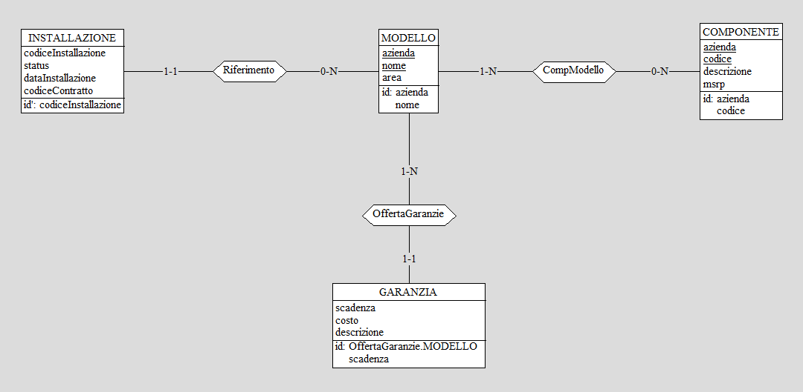

# Introduzione
Questo progetto consiste nella realizzazione di un sistema informatico che sia alla base della gestione di impianti energetici da fonti rinnovabili.
Questo sistema informatico si suddivide in quattro sotto-sistemi:
- Un sistema dedicato per organizzare, creare e completare interventi richiesti all'interno degli impianti
- un sistema SCADA (Supervisory Control And Data Acquisition), per la gestione da remoto degli impianti e dell'acquisizione dati.
- Un sistema gestionale utilizzato dai responsabili generali.
- Un database, utilizzato per la memorizzazione e la condivisione dei dati tra i vari sotto-sistemi.

# Analisi dei requisiti
## Intervista
Abbiamo intervistato il responsabile generale della GreenRock S.p.A per ottere più informazioni su come il sistema informatico deve essere strutturato:
> Abbiamo bisogno di un sistema gestionale che sia in grado di gestire impianti rinnovabili in tutta Italia. Attualmente abbiamo tre tipologie di impianto: Fotovoltaico, Eolico e Biogas.
> I nostri dipendenti si dividono in tre grandi categorie: responsabili, addetti SCADA e tecnici. Per ognuno memorizziamo nome, cognome e area di competenza. Per responsabili e addetti SCADA, loro operano su tutta una regione d'italia, mentre i tecnici possono lavorare soltanto all'interno di una provincia.
> I tecnici si occupano di effettuare vari interventi negli impianti, come per esempio dei controlli preventivi ai macchinari, la riparazione di un macchinario oppure la dismissione completa di un impianto.
> Gli interventi vengono creati dai responsabili, facendo richiesta di operare in un impianto o macchinario specifico, senza assegnarlo direttamente ad un tecnico. In un secondo momento i tecnici all'interno della provincia potranno prendersene carico. Soltanto un tecnico può essere incaricato per ogni intervento.
> Al termine di un intervento, il tecnico incaricato può scrivere delle note aggiuntive che devono essere inviate al responsabile che ha creato l'intervento. Per questo motivo i responsabili devono poter vedere tutti gli interventi, sia quelli completati che quelli in attesa.
> Gli impianti possono essere di un solo tipo e ogni impianto può contenere al suo interno soltanto macchinari di tipologia coerente.
> Nel caso in cui l'impianto sia fotovoltaico oppure eolico, vicino all'impianto vengono installate delle stazioni meteo che registrano i nodi di vento e la percentuale di raggi UV.
> Per gli impianti bisogna memorizzare il codice impianto, la provincia in cui si trova, l'indirizzo dell'impianto, l'area in metri quadri e se sono presenti tecnici al loro interno, in modo da segnalarlo agli addetti SCADA.
> Il codice impianto è valido soltanto all'interno della provincia di appartenenza dell'impianto.
> Noi compriamo i macchinari che vengono prodotti da aziende di terze parti, per cui dobbiamo tener traccia dell'azienda, del modello e della garanzia acquistata tra quelle disponibili per quel preciso modello. Sarebbe utile anche memorizzare le dimensioni del macchinario in termini di area piana e l'elenco delle componenti che possono essere sostituiti nei macchinari, con il loro prezzo.
> Questo elenco ci viene dato direttamente dall'OEM e i nostri tecnici sono certificati, per cui fare la sostituzione delle componenti elencate non annulla la garanzia.
> Quando un macchinario viene installato all'interno di un impianto, gli viene assegnato un codice interno che permette di distinguere due macchinari all'interno dello stesso impianto. Inoltre si deve tener traccia della data d'installazione, dato che questa viene usata per determinare l'inizio del periodo di garanzia.
> Nel caso l'installazione sia fotovoltaica, bisogna memorizzare anche il numero di celle, l'angolo con cui vengono montate le celle e la potenza massima complessiva che può essere generata.
> Nel caso l'installazione sia eolica, per ognuno di essi dobbiamo salvare  uno o più stime energetiche, basate sulla velocità del vento in nodi.
> Infatti lo stesso modello di macchinario, in base a come viene installato, potrebbe avere valori energetici diversi.
> Infine per le installazioni biogas dobbiamo tener traccia del rendimento energetico ottimale, la quantità di batteri presenti e il peso dei rifiuti organici necessari per mantenere il rendimento ottimo, queste ultime due misurate in kilogrammi.
> Gli addetti SCADA si occupano del controllo remoto di più impianti, potendo avviare e fermare i macchinari che sono contenuti al loro interno.
> Se un macchinario è attualmente in manutenzione, perchè un tecnico deve fare un intervento, per motivi di sicurezza gli addetti non possono controllare da remoto il macchinario. Soltanto quando il tecnico ha terminato il suo intervento, allora viene ripristinato il controllo agli addetti.
> Gli impianti che sono sotto la gestione di un determinato addetto SCADA vengono stabili da un responsabile della stessa regione. In generale lo stesso impianto può essere assegnato a più addetti.
> I responsabili possono chiedere agli addetti SCADA di generare dei report, utilizzati per analizzare le prestazioni energetiche di un impianto.
> Nel caso in cui un impianto è disposto di una stazione meteo, l'addetto SCADA che lo controlla può visualizzare la situazione metereologica attorno all'impianto scelto
> Quando viene installato un nuovo impianto in una regione, un responsabile di quella regione ha l'obbligo di inserire nel database tutti i dati rilevanti sull'impianto, compresi i macchinari al suo interno.

## Rilevamento delle ambiguità
L'intervista ad una prima lettura presenta delle ridondanze, ma queste non sono grandi abbastanza da impedire la comprensione del sistema informatico.
Le riportiamo comunque di seguito per avere maggior chiarezza:
- "Addetto SCADA" e "addetto" fanno riferimento alla stessa tipologia di dipendente
- "Installazione Fotovoltaica/Eolica/Biogas" è un sinonimo abbreviato di "Macchinario Fotovoltaico/Eolico/Biogas installato all'interno di un impianto"

## Correzione delle ambiguità ed estrazione dei concetti principali
Di seguito viene riportata l'intervista, corretta sostituendo le ambiguità e riportando i concetti principali.
Con il **grassetto** verranno indicate le entità principali,
con il *corsivo* verranno indicate informazioni importanti

> Abbiamo bisogno di un sistema gestionale che sia in grado di gestire impianti rinnovabili in tutta Italia. Attualmente abbiamo tre tipologie di impianto: *Fotovoltaico, Eolico e Biogas.*
> I nostri dipendenti si dividono in tre grandi categorie: **responsabili**, **addetti SCADA** e **tecnici**. Per ognuno memorizziamo *nome, cognome e area di competenza*. Per responsabili e addetti SCADA, loro operano su tutta una regione d'italia, mentre i tecnici possono lavorare soltanto all'interno di una provincia.
> I tecnici si occupano di effettuare vari **interventi** negli impianti, come per esempio dei *controlli preventivi* ai macchinari, la *riparazione di un macchinario* oppure la *dismissione completa di un impianto*.
> Gli interventi vengono creati dai responsabili, facendo richiesta di operare in un impianto o macchinario specifico, senza assegnarlo direttamente ad un tecnico. *In un secondo momento i tecnici* all'interno della provincia *potranno prendersene carico*. Soltanto un tecnico può essere incaricato per ogni intervento.
> Al termine di un intervento, il tecnico incaricato può scrivere delle note aggiuntive che devono essere inviate al responsabile che ha creato l'intervento. Per questo motivo i responsabili devono poter vedere tutti gli interventi, sia quelli completati che quelli in attesa.
> *Gli **impianti** possono essere di un solo tipo e ogni impianto può contenere al suo interno soltanto macchinari di tipologia coerente*.
> Nel caso in cui l'impianto sia fotovoltaico oppure eolico, vicino all'impianto vengono installate delle **stazioni meteo** che registrano i nodi di vento e la percentuale di raggi UV.
> Per gli impianti bisogna memorizzare il *codice impianto, la provincia in cui si trova, l'indirizzo dell'impianto, l'area in metri quadri e se sono presenti tecnici al loro interno*, in modo da segnalarlo agli addetti SCADA.
> Il codice impianto è valido soltanto all'interno della regione di appartenenza dell'impianto.
> Noi compriamo i **macchinari** che vengono prodotti da aziende di terze parti, per cui dobbiamo tener traccia *dell'azienda, del **modello** e della **garanzia** acquistata* tra quelle disponibili per quel preciso modello. Sarebbe utile anche memorizzare le dimensioni del macchinario in termini di area piana e l'elenco delle componenti che possono essere sostituiti nei macchinari, con il loro prezzo.
> Questo elenco ci viene dato direttamente dall'OEM e i nostri tecnici sono certificati, per cui fare la sostituzione delle componenti elencate non annulla la garanzia.
> *Quando un macchinario viene installato* all'interno di un impianto, *gli viene assegnato un codice interno* che permette di distinguere due macchinari all'interno dello stesso impianto. Inoltre si deve tener traccia della *data d'installazione*, dato che questa viene usata per determinare l'inizio del periodo di garanzia.
> Nel caso in cui venga installato un macchinario fotovoltaico, bisogna memorizzare anche il *numero di celle, l'angolo con cui vengono montate le celle e la potenza massima complessiva che può essere generata*.
> Nel caso in cui venga installato un macchinario eolico, per ognuno di essi dobbiamo salvare *uno o più stime energetiche, basate sulla velocità del vento in nodi*. Infatti lo stesso modello di macchinario, in base a come viene installato, potrebbe avere valori energetici diversi.
> Infine per i macchinari biogas dobbiamo tener traccia del *rendimento energetico ottimale, la quantità di batteri presenti e il peso dei rifiuti organici* necessari per mantenere il rendimento ottimo, queste ultime due misurate in kilogrammi.
> Gli addetti SCADA si occupano del controllo remoto di più impianti, potendo *avviare e fermare i macchinari* che sono contenuti al loro interno.
> *Se un macchinario è attualmente in manutenzione, perchè un tecnico deve fare un intervento, per motivi di sicurezza gli addetti SCADA non possono controllare da remoto il macchinario*. Soltanto quando il tecnico ha terminato il suo intervento, allora viene ripristinato il controllo agli addetti SCADA.
> Gli impianti che sono sotto la gestione di un determinato addetto SCADA vengono stabili da un responsabile della stessa regione. *In generale lo stesso impianto può essere assegnato a più addetti SCADA*.
> I responsabili possono chiedere agli addetti SCADA di *generare dei report*, utilizzati per analizzare le prestazioni energetiche di un impianto.
> Nel caso in cui un impianto è disposto di una stazione meteo, l'addetto SCADA che lo controlla può *visualizzare la situazione metereologica* attorno all'impianto scelto.
> Quando viene installato un nuovo impianto in una regione, un responsabile di quella regione ha l'obbligo di inserire nel database tutti i dati rilevanti sull'impianto, compresi i macchinari al suo interno.

## Definizione delle specifiche in linguaggio naturale
Riassumiamo in questa sezione le specifiche del sistema informatico:

Gli impianti e i macchinari possono essere di tre tipologie: Fotovoltaico, Eolico e Biogas.
Per gli impianti si memorizzano la tipologia, il codice impianto, la provincia, l'indirizzo, l'area in metri quadri e la possibile presenza di tecnici all'interno.

All'interno di un impianto di una tipologia si possono installare soltanto macchinari della stessa tipologia.

Per i macchinari si memorizzano azienda produttrice, modello, garanzia scelta, area in metri quadri, codice installazione, data installazione e status di operazione.

Per un particolare modello di macchinario si memorizzano tutte le garanzie disponibili e l'elenco delle componenti che possono essere sostituite dai tecnici.

In base alla tipologia del macchinario bisogna memorizzare dati aggiuntivi:
- Per fotovoltaico, numero di celle, angolo d'installazione e potenza massima complessiva
- Per eolico, un elenco di stime energetiche basate sulla velocità del vento
- Per biogas, il rendimento energetico ottimale, kilogrammi di batteri e kilogrammi di rifiuti organici

Le tipologie di utenti sono Tecnico, Addetto SCADA e Responsabile. Per tutti si memorizzano nome, cognome e area di competenza.

I tecnici possono:
- Accettare degli interventi
- Vedere gli interventi già accettati
- Segnalare agli addetti SCADA della presenza di un tecnico all'interno di un impianto
- Mettere in manutenzione un macchinario
- Confermare la conclusione di un intervento, con possibilità di scrivere note al responsabile.

Gli addetti SCADA possono:
- Avviare/Fermare un macchinario che non sia in manutenzione
- Visualizzazione della presenza di un tecnico all'interno di un impianto
- Generazione dei report richiesti dai responsabili
- Visualizzazione delle condizioni metereologiche di un impianto, se questo possiede la stazione meteo.

I responsabili possono:
- Creare nuove richieste di interventi
- Visualizzare lo storico di tutti gli interventi
- Visualizzazione delle note di fine intervento scritte dai tecnici
- Assegnazione del controllo di un impianto dagli addetti SCADA
- Inserimento di un nuovo impianto nel database.

# Progettazione concettuale
## Schema scheletro
Lo schema Entity-Relationship si compone di 4 gerarchie, tutte e 4 del tipo totali ed esclusive, di 22 entità e di 15 associazioni. Lo schema può essere suddiviso in 4 parti principali (impianti, modelli, interventi e utenti) che discuteremo dopo aver presentato in una tabella tutte le entità e tutte le associazioni con una loro breve descrizione.
Nome | Tipo | Descrizione
:---: |:---: | :---:
IMPIANTO | E | Rappresenta una struttura composta da uno o più macchinari
EOLICO | E | Una tipologia di impianto
FOTOVOLTAICO | E | Una tipologia di impianto
BIOGAS | E | Una tipologia di impianto
RILEVAZIONE_UV | E | Si occupa di rilevare i dati di un impianto fotovoltaico
RILEVAZIONE_VENTO | E | Si occupa di rilevare i dati di un impianto eolico
MACC_EOLICO | E | Rappresenta un singolo macchinario di tipo eolico
MACC_FOTOVOLTAICO | E | Rappresenta un singolo macchinario di tipo fotovoltaico
MACC_BIOGAS | E | Rappresenta un singolo macchinario di tipo biogas
INSTALLAZIONE | E | Indica l'azione di installare un macchinario in un determinato impianto
PRODUZIONE | E | L'energia prodotta (in Kwh) da un singolo macchinario
MODELLO | E | Indica l'azienda produttrice di un modello di macchinario
GARANZIA | E | Tipo di assicurazione su un macchinario
COMPONENTE | E | Pezzo facente parte di un macchinario (con msrp, cioè il prezzo di listino del pezzo)
PROVINCIA | E | Indica il luogo in cui possono essere situati gli impianti
UTENTE | E | Rappresenta le tipologie di lavoratori che possono accedere all'applicazione con permessi diversi
TECNICO | E | L'utente che si occupa di eseguire interventi su impianti e/o singoli macchinari
ADDETTO | E | L'utente che monitora gli impianti che gli sono stati assegnati
RESPONSABILE | E | L'utente che gestisce gli interventi, gli impianti e i macchinari
INTERVENTO | E | L'azione che può svolgere un tecnico su un macchinario o su un impianto
INT_IMPIANTO | E | Intervento svolto su un impianto
INT_MACCHINARIO | E | Intervento svolto su uno specifico macchinario
Monitora | A | Collega gli addetti agli impianti di cui si occupano
Situato | A | Mette in relazione l'impianto alla provincia in cui è situato
Assegnazione | A | A un tecnico viene assegnata una provincia in cui lavora
Accettazione | A | Collega i tecnici agli interventi che possono accettare
OpImpianto | A | Lega gli impianti agli interventi su di essi
OpMacchinario | A | Lega gli interventi ai macchinari su cui possono essere eseguiti
CompBiogas | A | Mette in relazione l'impianto biogas con i macchinari biogas
MeteoFotovoltaico | A | Collega l'impianto di tipo fotovoltaico con le rilevazioni uv
CompFotovoltaico | A | Mette in relazione l'impianto fotovoltaico con i macchinari fotovoltaici
MeteoEolico | A | Collega l'impianto di tipo eolico con le rilevazioni del vento
CompEolico | A | Mette in relazione l'impianto eolico con i macchinari eolici
ProdStorica | A | Lega i macchinari con le informazioni sulla loro energia prodotta
Riferimento | A | Relaziona i macchinari con il loro modello
CompModello | A | Collega i componenti che compongono un macchinario con il suo modello specifico
OffertaGaranzie | A | Lega le garanzie con i modelli dei macchinari

### Struttura degli impianti
Per modellare questo aspetto del database è stato scelto di utilizzare una gerarchia con superclasse l'entità `IMPIANTO` per suddividere tra loro le 3 diverse tipologie di impianto (eolico, fotovoltaico e biogas) e di collegarle rispettivamente, utilizzando altrettante associazioni, ai macchinari della stessa tipologia. Anche i macchinari, fanno parte di una gerarchia con superclasse l'entità `INSTALLAZIONE`, inoltre, entrambe le gerarchie sono totali ed esclusive. Questa modellazione rende evidente il fatto che un impianto di una tipologia deve necessariamente essere composto solo da macchinari dello stesso tipo.

### Struttura dei modelli, componenti e garanzia
Questa struttura è composta da 4 entità e da 3 associazioni. L'entità `MODELLO` fa riferimento al singolo macchinario, identificato dall'entità `INSTALLAZIONE`, ma nulla vieta che sia possibile installare più macchinari dello stesso modello. L'entità `GARANZIA` è legata al modello di macchinario, cioè ogni macchinario ha almeno una garanzia, che può essere la stessa per macchinari diversi, oppure può cambiare per ogni macchinario. Infine, l'entità `COMPONENTE` fa riferimento al singolo modello, perché è plausibile che i componenti di un macchinario possano cambiare da un modello all'altro.

### Struttura degli interventi
Per questo aspetto del database è stata utilizzata un'altra gerarchia, sempre totale ed esclusiva, con superclasse l'entità `INTERVENTO`. Le sottoclassi, sono le entità `INT_IMPIANTO` e `INT_MACCHINARIO`. La prima riguarda gli interventi che i tecnici, modellati dall'entità `TECNICO`, possono effettuare su un intero impianto, modellato dall'entità `IMPIANTO`. La seconda sottoclasse, invece, fa riferimento a quegli interventi che vengono svolti su un macchinario, modellato dall'entità `INSTALLAZIONE`. Un ultimo aspetto molto importante è che sono i tecnici ad accettare uno o più interventi da svolgere, grazie all'associazione `Accettazione`.

### Struttura degli utenti
In questa struttura gli utenti vengono modellati tramite l'entità `UTENTE`, che è superclasse per una gerarchia, anch'essa totale ed esclusiva, che comprende i 3 tipi di utenti dell'applicazione. Le tre tipologie sono le entità `RESPONSABILE`, `ADDETTO` e `TECNICO`. Sottolineiamo che l'addetto è collegato all'entità `IMPIANTO` dall'associazione `Monitora` e sta ad indicare che il suo compito è quello di gestire gli impianti che gli sono stati assegnati. Inoltre, il tecnico, come detto in precedenza, si occupa di svolgere gli interventi. Sia le assegnazioni degli impianti agli addetti sia le richieste di intervento, vengono tutte gestite dal responsabile.

## Raffinamenti proposti (a livello concettuale)

## Schema concettuale finale
Questo è lo schema generale del database, ottenuto unendo le 4 strutture analizzate in precedenza.

# Progettazione logica
## Stima del volume dei dati
## Descrizione delle operazioni principali e stima della loro frequenza
### Addetti
### Tecnici
### Responsabili
## Schemi di navigazione e tabelle degli accessi
## Raffinamento dello schema (eliminazione gerarchie, valori multipli, ...)
diviso per le varie parti?
## Analisi delle ridondanze
## Traduzione di entità e associazioni in relazioni
## Traduzione delle operazioni in SQL
Siccome l'applicazione non ricava i dati dal database attraverso una query unica, ma attraverso sotto query multipl, bisogna specificare come vengono eseguite in base ai vari parametri

# Progettazione dell'applicazione
## Descrizione dell'architettura dell'applicazione realizzata, con screenshot
